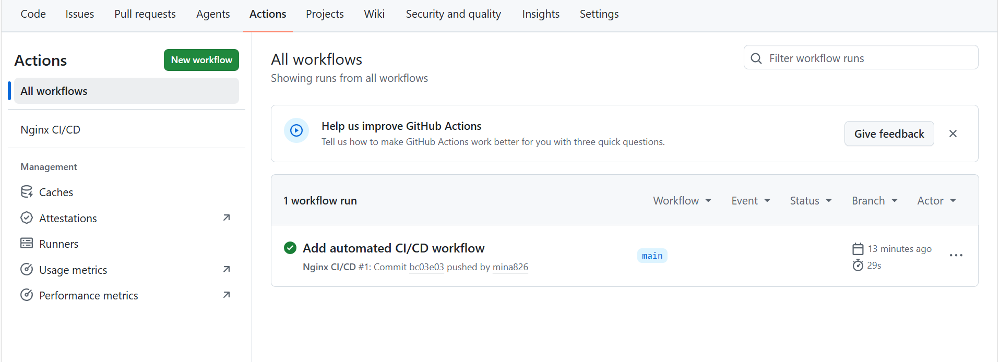
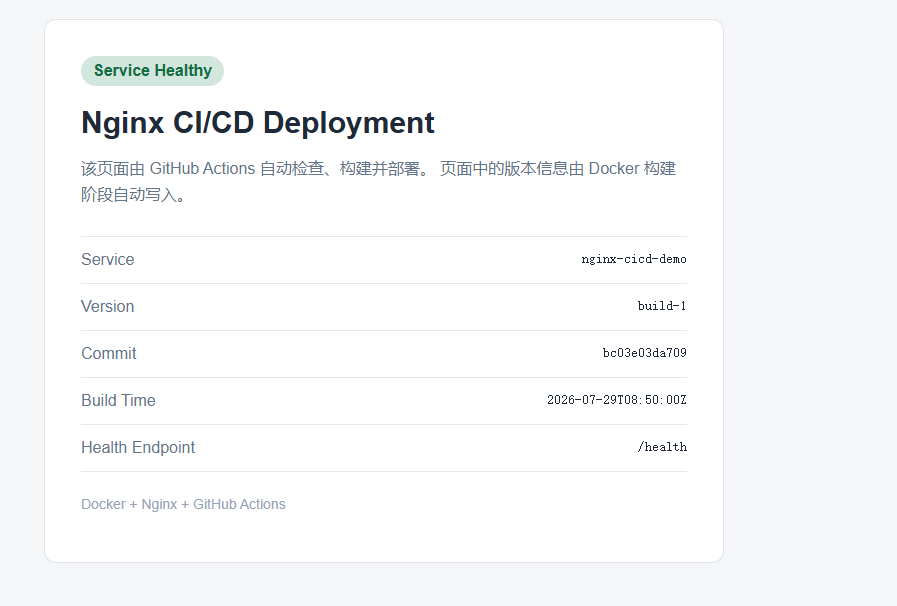
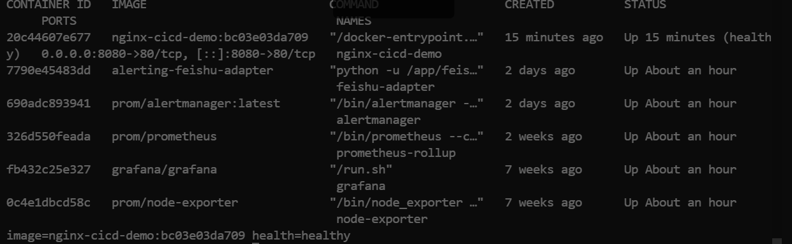

# Nginx CI/CD 自动化部署项目

基于 Docker、Nginx、GitHub Actions 和 self-hosted Runner 实现的自动化部署项目。

代码推送到 GitHub 后，Runner 会自动校验配置、构建版本化镜像、部署容器并执行健康检查；新版本异常时，部署脚本可自动回滚到上一个可用版本。

## 项目架构

```text
开发者提交代码
      |
      v
GitHub Repository
      |
      v
GitHub Actions
      |
      v
Self-hosted Runner（Ubuntu VM）
      |
      v
构建 Docker 镜像
      |
      v
Docker Compose 部署 Nginx
      |
      v
健康检查与版本验证
      |
      +---- 失败：自动回滚旧版本
      |
      +---- 成功：完成部署
```

## 核心功能

- GitHub Actions 持续集成与自动部署
- Ubuntu self-hosted Runner 私有环境部署
- Docker 镜像版本化构建
- Docker Compose 容器编排
- Nginx 静态页面与 `/health` 健康检查接口
- 部署前 Bash 和 Compose 配置校验
- 部署后容器健康状态与页面版本验证
- 新版本异常时自动回滚
- GitHub Actions 并发控制和任务摘要

## 技术栈

- Linux / Ubuntu
- Docker / Docker Compose
- Nginx
- Git / GitHub
- GitHub Actions
- Bash
- curl

## CI/CD 流程

当代码推送到 `main` 分支时，工作流自动执行：

1. 拉取仓库代码。
2. 使用 `bash -n` 检查部署脚本语法。
3. 使用 `docker compose config` 校验 Compose 配置。
4. 构建包含版本、Commit SHA 和构建时间的 Docker 镜像。
5. 调用 `scripts/deploy.sh` 部署新镜像。
6. 检查容器 Docker Health 状态。
7. 请求 `/health` 验证 Nginx 服务。
8. 检查首页中的 Commit SHA，确认部署版本正确。
9. 部署失败时恢复到上一个健康镜像。

## 项目结构

```text
nginx-cicd-deployment/
├── .github/
│   └── workflows/
│       └── deploy.yml
├── nginx/
│   └── default.conf
├── scripts/
│   └── deploy.sh
├── site/
│   └── index.html
├── .dockerignore
├── .gitattributes
├── .gitignore
├── compose.yml
├── Dockerfile
└── README.md
```

## 健康检查

Nginx 提供健康检查接口：

```bash
curl http://127.0.0.1:8080/health
```

正常响应：

```json
{"status":"healthy","service":"nginx-cicd-demo"}
```

查看容器镜像和健康状态：

```bash
docker inspect nginx-cicd-demo \
  --format 'image={{.Config.Image}} health={{.State.Health.Status}}'
```

## 手动构建与部署

构建镜像：

```bash
docker build \
  --build-arg VERSION="v1.0.0" \
  --build-arg COMMIT_SHA="$(git rev-parse --short=12 HEAD)" \
  --build-arg BUILD_TIME="$(date -u +'%Y-%m-%dT%H:%M:%SZ')" \
  -t nginx-cicd-demo:v1.0.0 \
  .
```

部署镜像：

```bash
chmod 755 scripts/deploy.sh
./scripts/deploy.sh nginx-cicd-demo:v1.0.0
```

## 项目成果

### GitHub Actions 执行成功



### 自动部署后的页面



### 容器健康状态



## 项目价值

该项目将手动部署流程改造成可重复、可验证、可回滚的自动化流程，减少了人工操作和版本不一致问题，并实践了运维与 DevOps 岗位常用的容器化、持续部署、健康检查和故障恢复能力。

